# Spore Mod - 架构文档

> 自动生成于: 2026-05-04 10:41:09
> 项目类型: Minecraft Forge Mod (1.20.1)
> 构建工具: Gradle (Java 17)
> 作者: Harbinger
> 版本: 2.0.1

---

## 项目愿景

Spore 是一个关于真菌感染和生物实验的 Minecraft Forge 模组。玩家将探索一个被真菌感染的世界，面对不同进化阶段的感染生物，利用生物材料制造武器、装备和药剂，最终揭示感染的真相。

---

## 架构总览

本 Mod 采用标准的 Minecraft Forge 单模块架构，使用 DeferredRegister 进行惰性注册。主入口 `Spore.java` 协调所有核心注册表的初始化。

### 技术栈

| 技术 | 用途 |
|------|------|
| Minecraft Forge 47.1.0 | Mod 加载框架 (MC 1.20.1) |
| DeferredRegister | 惰性注册系统 |
| ASM 9.5 + Instrumentation API | 运行时字节码变换 (CoreMod) |
| JEI 15.8.2.25 | 配方显示集成 |
| SimpleChannel | 网络包通信 |

### 关键依赖

- `net.minecraftforge:forge:1.20.1-47.1.0`
- `org.ow2.asm:asm:9.5` (CoreMod 字节码操作)
- `org.ow2.asm:asm-commons:9.5`
- `org.ow2.asm:asm-tree:9.5`
- `mezz.jei:jei-1.20.1-forge:15.8.2.25` (JEI API 集成)

---

## 模块结构图

```mermaid
graph TD
    A["(根) Spore Mod"] --> B["Core Registry"];
    A --> C["Sitems"];
    A --> D["Sblocks"];
    A --> E["Sentities"];
    A --> F["Screens"];
    A --> G["SBlockEntities"];
    A --> H["sEvents"];
    A --> I["Effect"];
    A --> J["Senchantments"];
    A --> K["Recipes"];
    A --> L["Damage"];
    A --> M["Fluids"];
    A --> N["ExtremelySusThings"];
    A --> O["coremod"];
    A --> P["util"];
    A --> Q["Resources"];

    B --> B1["Sblocks.java"];
    B --> B2["Sitems.java"];
    B --> B3["Sentities.java"];
    B --> B4["Seffects.java"];
    B --> B5["Ssounds.java"];
    B --> B6["Sparticles.java"];
    B --> B7["SConfig.java"];
    B --> B8["Senchantments.java"];
    B --> B9["Spotion.java"];
    B --> B10["Srecipes.java"];
    B --> B11["SMenu.java"];
    B --> B12["Sfluids.java"];
    B --> B13["Sfeatures.java"];
    B --> B14["Spaintings.java"];
    B --> B15["SblockEntities.java"];
    B --> B16["SAttributes.java"];
    B --> B17["ScreativeTab.java"];
    B --> B18["SticketType.java"];

    E --> E1["BasicInfected"];
    E --> E2["EvolvedInfected"];
    E --> E3["Hyper"];
    E --> E4["Calamities"];
    E --> E5["Organoids"];
    E --> E6["Experiments"];
    E --> E7["Projectile"];
    E --> E8["Utility"];
    E --> E9["BaseEntities"];
    E --> E10["FallenMultipart"];

    C --> C1["BaseWeapons"];
    C --> C2["Guns"];
    C --> C3["Agents"];

    N --> N1["Package (Network)"];
    N --> N2["CustomJsonReader"];
    N --> N3["BiomeModification"];
    N --> N4["StructureModification"];

    Q --> Q1["assets/spore"];
    Q --> Q2["data/spore"];
    Q --> Q3["META-INF"];

    click A "./CLAUDE.md" "返回根文档"
    click B "./src/main/java/com/Harbinger/Spore/Core/CLAUDE.md" "Core Registry"
    click D "./src/main/java/com/Harbinger/Spore/Sblocks/CLAUDE.md" "Blocks"
    click E "./src/main/java/com/Harbinger/Spore/Sentities/CLAUDE.md" "Entities"
    click C "./src/main/java/com/Harbinger/Spore/Sitems/CLAUDE.md" "Items"
    click H "./src/main/java/com/Harbinger/Spore/sEvents/CLAUDE.md" "Events"
    click O "./src/main/java/com/Harbinger/Spore/coremod/CLAUDE.md" "CoreMod"
    click N "./src/main/java/com/Harbinger/Spore/ExtremelySusThings/CLAUDE.md" "Networking & World Gen"
    click F "./src/main/java/com/Harbinger/Spore/Screens/CLAUDE.md" "Screens"
    click G "./src/main/java/com/Harbinger/Spore/SBlockEntities/CLAUDE.md" "Block Entities"
    click I "./src/main/java/com/Harbinger/Spore/Effect/CLAUDE.md" "Effects"
    click J "./src/main/java/com/Harbinger/Spore/Senchantments/CLAUDE.md" "Enchantments"
    click K "./src/main/java/com/Harbinger/Spore/Recipes/CLAUDE.md" "Recipes"
    click L "./src/main/java/com/Harbinger/Spore/Damage/CLAUDE.md" "Damage Types"
    click M "./src/main/java/com/Harbinger/Spore/Fluids/CLAUDE.md" "Fluids"
```



---

## 模块索引

| 模块 | 路径 | 职责 | 入口 | 测试 |
|------|------|------|------|------|
| Core Registry | `Core/` | 注册所有方块、物品、实体、特效、声音、配方等 | Sblocks, Sitems, Sentities 等 | 无 |
| Items | `Sitems/` | 武器(20+)、盔甲(4套)、食物(30+)、工具、注射器、试剂 | InfectedSaber, SporeSpawnEgg 等 | 无 |
| Blocks | `Sblocks/` | 实验室方块、感染方块、真菌植被、机械方块 | Acid, Incubator, CDUBlock 等 | 无 |
| Entities | `Sentities/` | 6阶感染生物体系 (含15+投射物) | InfectedHuman ~ Leviathan | 无 |
| Screens | `Screens/` | 12种GUI菜单 | ContainerMenu, SurgeryMenu 等 | 无 |
| BlockEntities | `SBlockEntities/` | 10种方块实体 | CDUBlockEntity, IncubatorBlockEntity | 无 |
| Events | `sEvents/` | Forge事件处理 | HandlerEvents | 无 |
| Effects | `Effect/` | 6个自定义状态效果 | Mycelium, Madness, Starvation | 无 |
| Enchantments | `Senchantments/` | 9个自定义附魔 | SymbioticReconstitution, CryogenicAspect | 无 |
| Recipes | `Recipes/` | 4种自定义配方类型 | Surgery, Grafting, Injection, Assimilation | 无 |
| Damage | `Damage/` | 自定义伤害类型系统 | SdamageTypes | 无 |
| Fluids | `Fluids/` | 胆汁液体实现 | BileLiquid | 无 |
| Networking/World | `ExtremelySusThings/` | 网络包(9种)、生物群系/结构修改、JSON数据加载 | SporePacketHandler | 无 |
| CoreMod | `coremod/` | 运行时字节码变换(ASM+Instrumentation) | CoreModMain (反作弊) | 无 |
| Resources | `resources/` | 纹理、模型、声音、语言、数据文件 | mods.toml, pack.mcmeta | 无 |

---

## 实体体系

Mod 的实体分为 6 个进化阶层 + 大量投射物:

| 阶层 | 特点 | 示例 |
|------|------|------|
| BasicInfected | 基础感染生物 (由原版生物感染) | InfectedHuman, InfectedVillager, InfectedDrowned 等 10+ |
| EvolvedInfected | 进化感染生物 | Knight, Griefer, Leaper, Slasher, Howler 等 25+ |
| Hyper | 超感染生物 (小型Boss) | Wendigo, Inquisitor, Ogre, Hevoker 等 8 |
| Calamities | 灾厄级 (巨型Boss, Multipart) | Sieger, Gazenbreacher, Hindenburg, Leviathan 等 8 |
| Organoids | 器官类生物 | Vigil, Usurper, Proto, HiveTumor 等 11 |
| Experiments | 实验体 | Plagued, Lacerator, Biobloob, Saugling |

自定义 MobCategory: `INFECTED` (配置cap), `ORGANOID` (cap=20)

---

## 核心机制

### 方块机器系统

方块提供多种机器功能，通过 GUI 菜单操作:
- **CDU**: 中央处理单元 - 实体转换
- **Surgery Table**: 手术台 - 生物改造
- **Zoaholic**: 分析仪
- **Incubator**: 孵化器
- **Container**: 容器存储
- **Cabinet**: 柜子
- **Injection/Grafting**: 注射和嫁接合成

### 武器变异系统

通过注射器(WeaponSyringe/ArmorSyringe)给武器/盔甲附加自定义附魔:
- 武器: 吸血/钙化/狂战/毒液/腐烂
- 盔甲: 强化/骨骼/溺亡/焦炭

### CoreMod 反作弊

- 运行时字节码变换修改所有 `LivingEntity.getHealth()`
- Spore 的 Boss 实体通过 `SporeBossEntity` 接口特殊处理
- 防 Mixin 篡改保护

---

## 运行与开发

### 环境要求

- Java 17+
- Minecraft Forge 1.20.1-47.1.0
- Gradle (通过 wrapper 管理)

### 常用 Gradle 命令

```bash
./gradlew runClient        # 启动客户端
./gradlew runServer        # 启动服务器
./gradlew runData          # 运行数据生成器
./gradlew build            # 构建 jar
```

### 配置

- 服务器配置: `run/sporeconfig.toml` (`SConfig.SERVER`)
- 数据配置: `run/sporedata.toml` (`SConfig.DATAGEN`)

---

## 测试策略

> **主要缺口**: 项目目前无任何测试文件。这是最重要的改进方向。

建议:
1. Forge GameTest (`@GameTest`) 测试方块放置/破坏、机器交互
2. Mockito + JUnit 测试配方序列化、配置加载
3. 手动测试清单: 所有生物生成、武器攻击、盔甲效果

---

## 编码规范

- 包命名: `com.Harbinger.Spore.<module>`
- 注册表类前缀: `S` (Sblocks, Sitems 等)
- 文件编码: UTF-8
- 目标 Java 版本: 17
- 构建工具: Gradle

---

## AI 使用指引

- **注册流程**: 查看 `Core/` 目录下的各 `S*.java` 文件
- **实体 AI**: `Sentities/<Tier>/` 目录，继承 Forge/MC 实体基类
- **自定义配方**: `Recipes/` + `Screens/` + `Srecipes.java`
- **CoreMod 字节码**: `coremod/` 使用 ASM Tree API
- **配置**: `SConfig.java` + `ExtremelySusThings/CustomJsonReader/`
- **网络包**: `ExtremelySusThings/Package/` + `SporePacketHandler.java`

---

## 已知缺口 (需后续补扫)

1. **无测试**: 整个项目缺少测试文件
2. **Screens 未详读**: 12 种 GUI 菜单的具体槽位布局
3. **SBlockEntities 未详读**: 方块实体的 tick 逻辑细节
4. **Recipes 未详读**: 4 种配方的 JSON 序列化/反序列化
5. **util 未详读**: EntityUtil, UnsafeUtil 等工具类
6. **资源文件未详读**: assets/ 和 data/ 目录的具体内容
7. **Entity 子目录未详读**: 每个实体类的具体 AI 和行为

---

## 变更记录 (Changelog)

### 2026-05-04 (init-architect 初始化)

- 创建根级 CLAUDE.md (本文档)
- 创建 7 个模块级 CLAUDE.md (Core, Sitems, Sentities, Sblocks, sEvents, coremod, ExtremelySusThings)
- 创建 claude_index.json (扫描索引)
- 生成 Mermaid 模块结构图 (可点击导航)
- 已为 7 个模块添加面包屑导航
- 扫描覆盖率: ~7.8% (45/580 文件详读)
- 注意: `.claude/index.json` 因权限限制被写入为 `claude_index.json`
